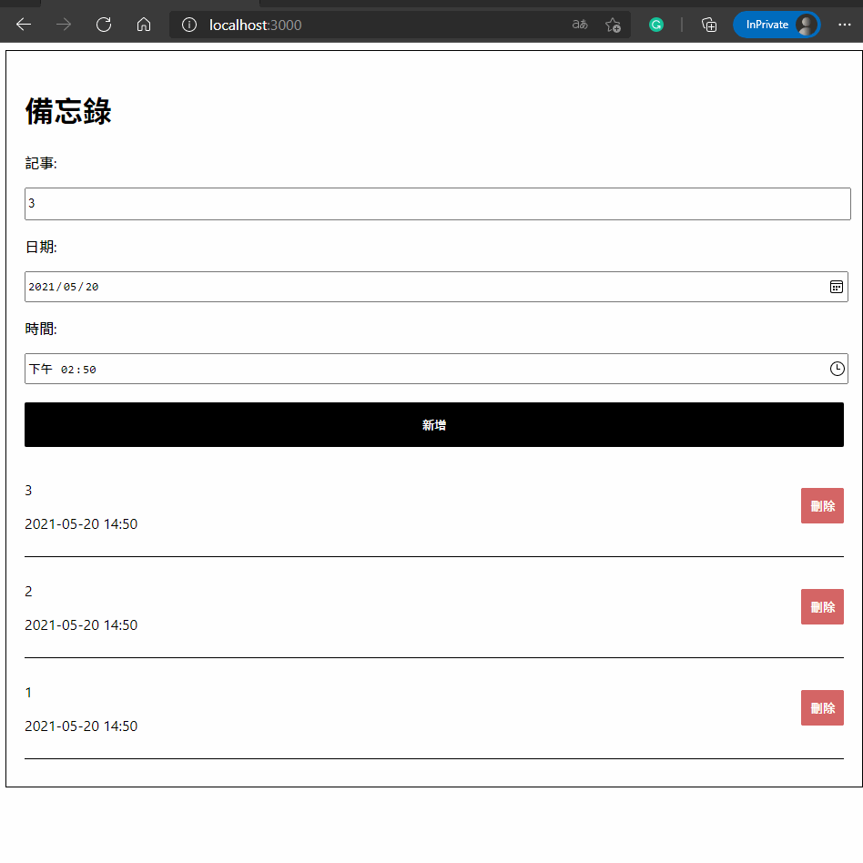

# React learning #1

### Simple react note app

Forked from: https://github.com/scps960740/React-crash-course-2021-bruceFE

Youtube video link:
https://www.youtube.com/watch?v=zqV7NIFGDrQ

# Features

- create-react-app
- The source code was refactored by Typescript
- react hook
- json-server for mock API server

# How to use

- Install packages

```shell
npm run install
```
- Start application

```shell
# Start json-server for mock API.
npm run server

# Start application.
npm run start
```

- Build

```shell
npm run build
```

# Screenshot



